# Introduction

This page will attempt to describe the process of using a new Arma map/terrain (I'll use the terms interchangably) in the TVR mod and Tacview. While not hard, it's a bit of a process, and does require a little technical skill. I'll do my best to document it step by step.

The rough process looks like:
1. Write some metadata that describes the map for the mod, Tacview and scripts
2. Export from Arma the map image and height data, run some post-processing and copy it into your Tacview installation
3. Open up the Arma mod, add the map metadata and check it all works

# Prerequisites

In order to perform these steps you'll need:

1. A Bash-like terminal and a Python environment. Unfortunately this isn't entirely trivial, there are a number of ways of setting this up and all the details are well outside the scope of this documentation. The simplest and quickest way is probably:
   1. Install WSL2 (lots of tutorials on youtube) and the default Ubuntu VM
   2. Open up the Ubuntu terminal and install python: `sudo apt-get install python3 python-is-python3`
2. A handful of command line linux tools: `zip`, `unzip`, `sed` and `jq`. If you're running the Ubuntu VM under WSL then you can: `sudo apt-get install zip unzip jq` (`sed`s there out of the box)
3. A local copy of this repo: `git clone https://github.com/petekneller/a3_tvr_terrains`
3. The Python packages specified in this repo: `python -m pip install -r requirements.txt`. **NB** You might want to create a virtual environment for this project. If you don't know what I'm talking about then don't worry about it.
4. Tools for manipulating Arma PBO files. I'm using [PBO manager](https://github.com/winseros/pboman3) but anything that lets you work with PBOs is fine.

# 1. Map metadata

Firstly you'll need to define some properties of the map. Open up the `world_config.yaml` file at the root of this repository in any text editor (I'll be using [Notepad++](https://notepad-plus-plus.org/) for these examples). The top of the file looks like the this:

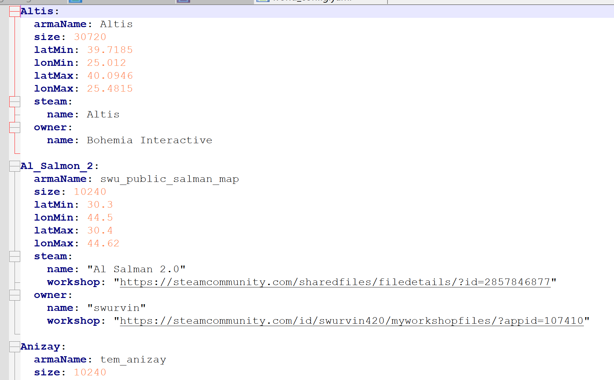

Each block contains information about a single Arma terrain. Copy and paste one, any one. I've ordered them alphabetically but it isn't important for our purposes. Then you'll need to:

## 1.1. Give it a name

That first piece of text before the colon is intended to be a convenient name for the terrain. Arma has an internal name (the 'world name') but it isn't always helpful. For example Malden's world name is 'abel' and Kolgujev is 'cain'. The name must be unique amongst the other worlds in that file, and it can't contain whitespace or punctuation. I'd suggest sticking with capitalised words and underscores separating them. The only place you're likely to see it is in the name of the recording (ACMI) files the mod produces (for example the last recording I made was saved as `Tacview-20251216-124218-Arma3-Virtual_Reality.acmi` where `Virtual_Reality` is the terrain name).

I'm going to follow along from here and demonstrate the process by adding the Yulakia map by IceBreakr which has been requested by the community but not yet added.

## 1.2. Add the Arma metadata

The `armaName` field needs to specify the name with which Arma refers to the terrain. You can find this by opening the terrain in the editor (you don't need to start a mission), opening the debug console and displaying the value of `worldName`. See the screenshot below. The `size` field you can fetch the same way by fetching the value of `worldSize`. For Yulakia these are `yulakia` and `12800` respectively.

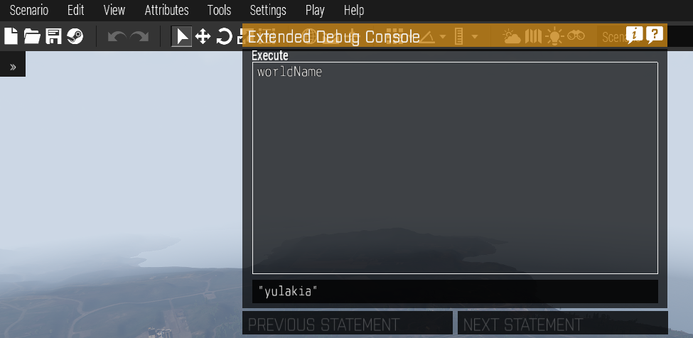

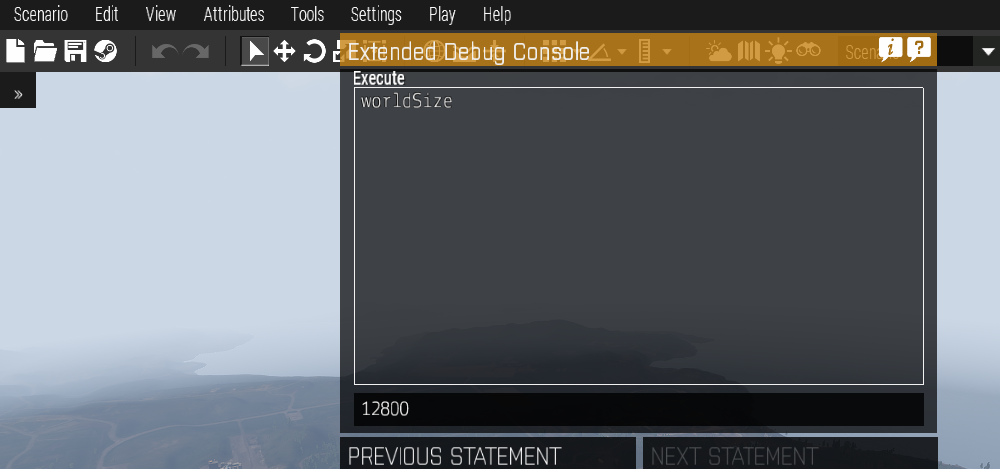

## 1.3. Place the terrain in the world

While terrains in Arma are (relatively) small, flat squares, when we record a mission and replay it in Tacview it has to appear somewhere on the globe. It doesn't really matter where - most Arma terrains are fictional after all - but all the terrains need to be placed somewhere on the Earth and _they can't overlap_. The four fields `latMin`, `lonMin`, `latMax` and `lonMax` define the bottom-left and top-right corners of the terrain in latitude and longitude. Positive latitudes are north of the equator, negative south. Positive longitudes are east of the Greenwich meridian, negatives west.

Some pointers:

* The distances on the map do _not_ need to correspond precisely to those in Arma. As we found earlier the Yulakia terrain has a size of 12800. That's 12800 metres x 12800 metres. For reasons I won't explain here it wouldn't matter if I placed that into a square in Tacview that had a side length of 12800 m, or 1 km, or 100 km. Roughly the right size is good enough. At the equator 1 degree is 111 km on the ground and since most Arma maps are around 10 km on a side then a square with side 0.1 degree works well. With the following caveat...

* 1 degree of longitude is only 111 km at the equator. As you leave the equator then 1 degree of longitude becomes less when measured on the ground. At 45 degrees north 1 degree of longitude is only 79 km. So if you set the coordinates of your terrain such that the region has sides of 0.1 degree in both dimensions but you're far from the equator then when viewed in Tacview it won't be square. This isn't actually a problem, but it looks a bit wierd. It's pretty easy to google how the distance changes with latitude but another approach you could take is to find an existing terrain in `world_config.yaml` that's roughly at the same latitude you want to use and see how that's been set up.

* I've taken the approach that if a terrain is based on a real-world location I'll try to place it somewhat accurately. If its fictional, or based in the real-world but of vastly different scale then I'll plonk it in roughly the right location. Altis, for example, is based on the Greek island of Limnos and of similar size. Cam Lao Nam, however, is representative of thousands of square kilometres of Cambodia, Laos and Vietnam, even though its only 20 km square in the game. The screeshots of Tacview below show how I've decided to deal with this. You can see that Altis sits nicely over its real-life equivalent. And Cam Lao Nam sits as a tiny speck in the corner of its real-life peninsula.

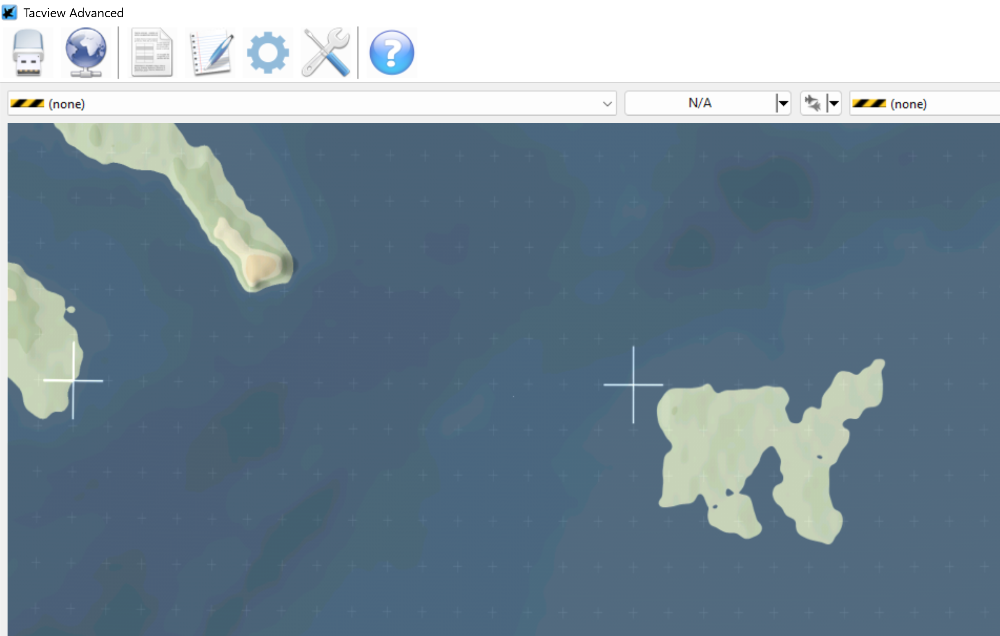

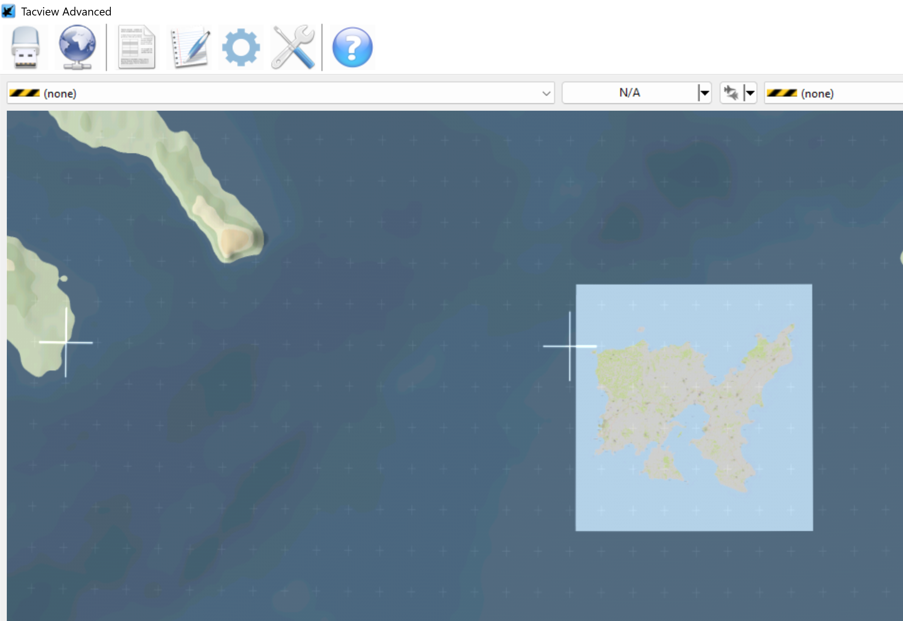

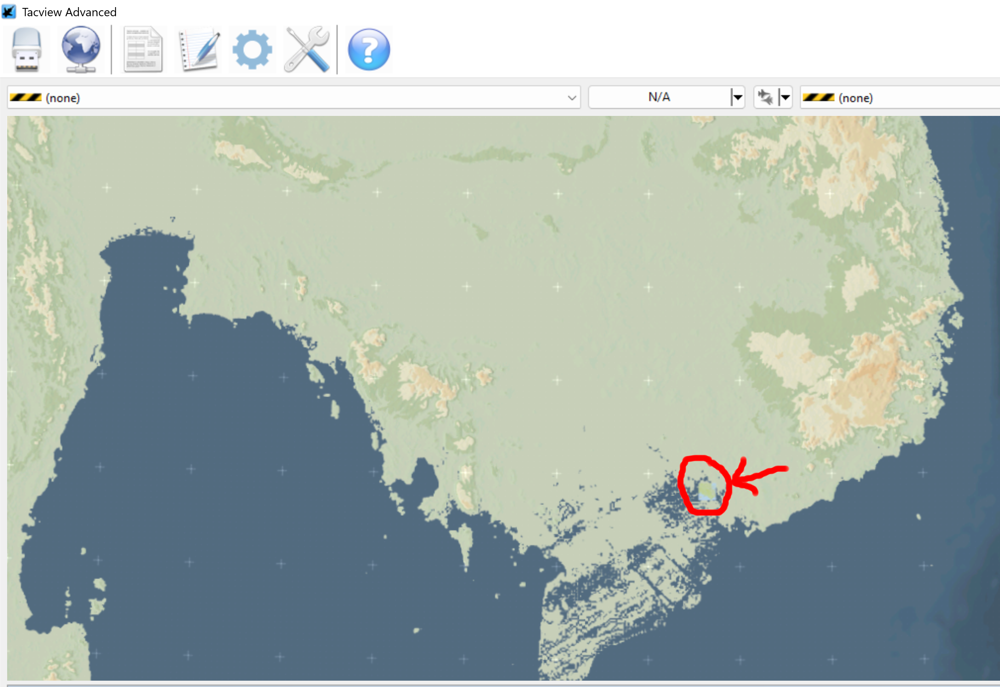

We'll make the above more concrete by looking again at Yulakia. The workshop page suggests it's an island nation in Eastern Europe. There's a small island at the northern end of the Caspian Sea - that works as well as anything else.

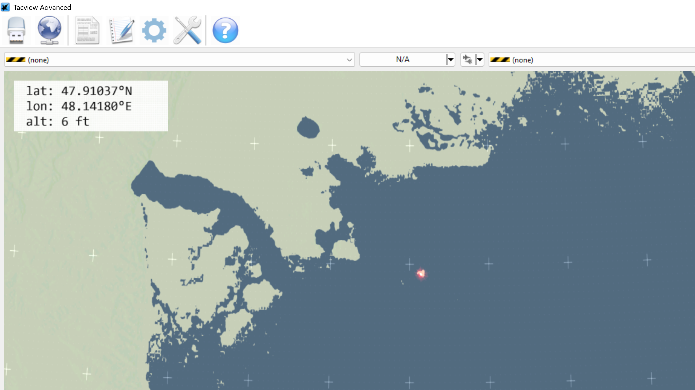

Tacview tells us the island is located at 47.9 North. Let's give it a region 0.1 degree in latitude centred on that location - from 47.85 North to 47.95 North. Hurtgen Forest is in `world_config` and at a latitude of 50 North - incredibly close. Admittedly many of Arma's world are situated in Europe and the Middle East between the latitudes of 30 and 60 North so its relatively easy to find this example. For Hurtgen Forest I've used a region of size 0.1 degree in latitude but 0.15 degree in longitude. We'll try that again. Our island of interest is at 48.14 East, so let's put Yulakia in a region with longitude between 48.05 and 48.20 East.

For what it's worth, figuring out where to put a terrain on the Earth and getting it square-ish is probably the hardest part of the process. So if you've stuck with it so far, it only gets easier from here (well, a little).

## 1.4. Ignore the rest of the fields - for now

The remaining fields in the YAML provide information for when the terrains appear here on the download page and are important for attributing the work to their owners. But if you're just using a terrain locally then they'll never be used. The two `workshop` fields are optional and can be deleted. The two remaining are not optional, but can be left empty - you can make them `name: ""` and `owner: ""`.

At this point in the process we have, for Yulakia, the following changes to the `world_config` file, show in Notepad++:

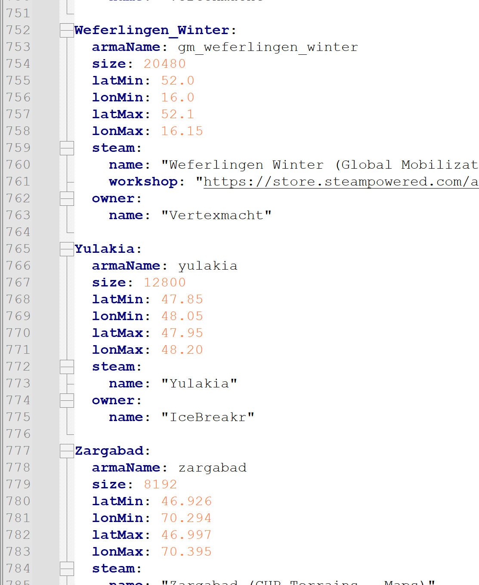

# 2. Export of map data to Tacview

We now need two pieces of data from Arma: the image of the map and the terrain elevation. The first is easy, Arma includes a function [diag_exportTerrainSVG](https://community.bistudio.com/wiki/diag_exportTerrainSVG) that spits out the image. To achieve The second I've written a script that spits out the height data as a CSV file (this is heavily inspired by [this example](https://github.com/Keithenneu/Beowulf.ArmaTerrainExport) by Keithenneu).

I've simplified the above slightly by creating templated missions that export both the image and height data in their initialisation. What? It'll make sense in a minute.

1. First, you'll need to switch to the development build of Arma (`diag_exportTerrainSVG` is only available in the development build). Within Steam right click on the game name in the list -> _Properties_ -> _Betas_ -> _Beta participation_ = _development_. This will likely download a couple of Gb and so might take a little while, depending on your internet connection.

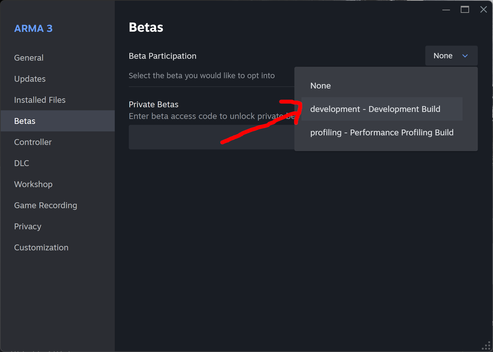

2. In a terminal console navigate into the git repo and run the `bin/generate_export_mission.sh` script. This takes two arguments: the location to which you want to save the image & elevation files, and the name of the terrain (the name you chose for it - not the Arma name). Pick the save location carefully - it needs to be somewhere that Arma has permission access. Don't try the root of C drive. Arma's unlikely to be able to write there and you _won't_ get a good error message telling you what went wrong. My suggestion is to just use your Documents folder.

So on my machine and with our Yulakia example my command line is: `bin/generate_export_mission.sh "C:\Users\mrkne\Documents" Yulakia`.

3. Have look in the `out/missions` folder and you'll find an Arma mission folder titled (in my example) `terrain_export.yulakia`. Note that the folder will have Arma's internal name of the terrain at the end, not the one you chose. Copy this mission to wherever your Arma installation expects to find custom missions. On my machine with Arma installed by Steam its _Documents/Arma 3/missions_, but yours may vary.

4. Fire up Arma. Ensure you have the Tacview Record mod enabled (the mission uses some of TVR's functions to write the files). Unfortunately, as well as being part of the development build the function `diag_exportTerrainSVG` is also only in the [diagnostic exe](https://community.bistudio.com/wiki/Arma_3:_Diagnostics_Exe). So you can't just start Arma from the standard launcher. There are a few ways to do this. What I prefer to do is to start Arma the usual way with all the mods I need (at a minimum Tacview Recorder and the terrain/s you're trying to add). I then immediately close the game and open one of the log files ('rpt' files; on my Steam installation they're written to `%localappdata%\Arma 3`) in a text editor. Near the top of the file is the command line used to start the game. I copy that, paste it to a Windows command prompt (NB not the bash prompt you've been using so far) and change the name of the exe from `arma3_x64.exe` to `arma3diag_x64.exe`. My whole command prompt at this point looks like:
`"C:\Program Files (x86)\Steam\steamapps\common\Arma 3\Arma3diag_x64.exe" "-mod=C:\Program Files (x86)\Steam\steamapps\common\Arma 3\!Workshop\@CBA_A3;C:\Program Files (x86)\Steam\steamapps\common\Arma 3\!Workshop\@Tacview Recorder;C:\Program Files (x86)\Steam\steamapps\common\Arma 3\!Workshop\@CUP Terrains - Core;C:\Program Files (x86)\Steam\steamapps\common\Arma 3\!Workshop\@Yulakia"`
Yours will of course be different based on the terrain you're working with, but you should also have CBA and TVR.

Open up the editor. Open up the terrain export mission. 'Play' the mission. You'll find you're facing the loading screen for some time, easily a minute for a large map. This is ok. What's happening in the mission initialisation is the exporting of the map and elevation data. Once you're in the mission the works all done and you can exit straight out again.

5. Have a look in the location where you told the mission to write the file. In my example that's my Documents folder. You should see two new files: an SVG image and a `.elev` file.

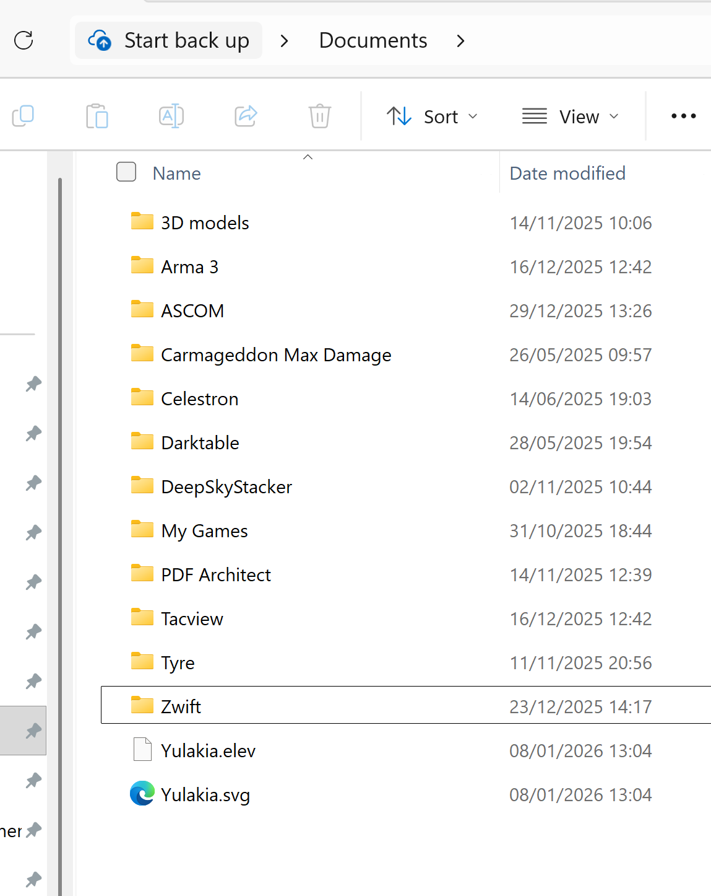

Zip up those files. It doesn't matter whether you use Windows built-in compression tools, WinZip, 7Zip, etc. But they need to be in the `zip` format, not `7z`, `rar` or any other archive type. Zip them up individually and name the archives with the original name and an extra `.zip` extension.

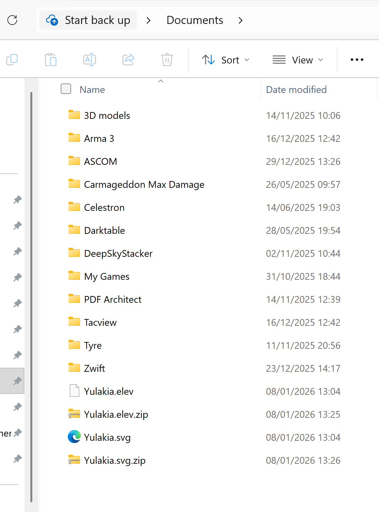

Copy the zip files to the `src` folder of this repo.

6. Pop back to your bash prompt and run some scripts:

* `bin/postprocess_elev.sh <name of your terrain>`
* `bin/svg_to_png.sh <name of your terrain>`
* `bin/generate_configs.sh`

`svg_to_png` could take some time, possibly several minutes. `postprocess_elev` converts the elevation data from CSV into the format Tacview wants. It's fairly quick. The last script creates configuration files for both Tacview and Arma so they know about the new terrain.

6. When you first started using TVR and downloaded the terrains in which you were interested you unzipped those files into a custom folder for Tacview. On my installation that's `%appdata%\Tacview` but it might differ if you've installed it via Steam. You'll know you've got the right one when the contents of that folder are two subfolders `Data` and `AddOns`. You can copy custom content directly to the Tacview installation directory, but its not what I like to do.

Look in the `out/tacview` folder of this repo. You should find a `<your terrain name>.dat` and `CustomHeightmapList.xml`. Copy those files into the Tacview folder you found earlier, under the `Data\Terrain\Custom` subfolder. You'll probably find there's a `Data\Terrain\ARMA` folder as well - ignore it (this process predates Tacview having official support for Arma).

Back in the `out/tacview` folder of this repo you should now find a `<your terrain name>.png` and `CustomTextureList.xml`. Copy those files into the Tacview folder, under the `Data\Terrain\Textures` subfolder. Again, ignore the ARMA folder in there.

After I've done this for Yulakia those folders look like the following:

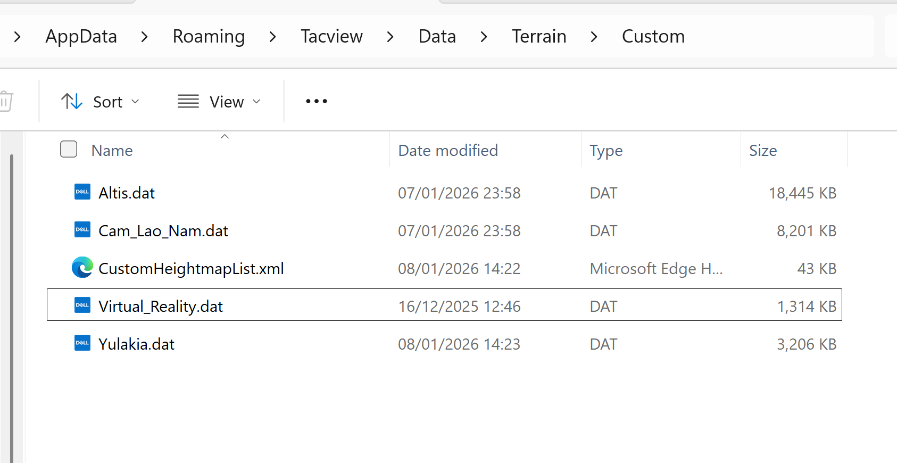

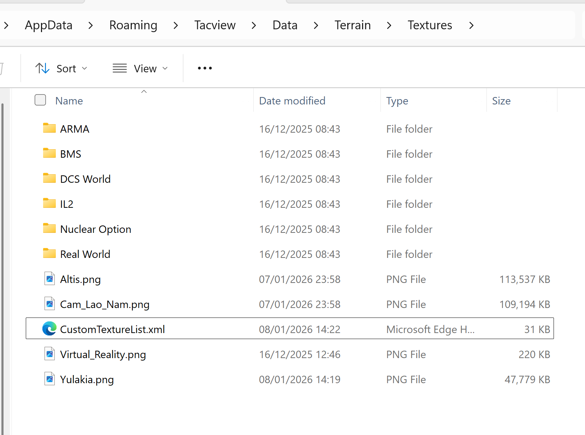

7. At this point you can open up Tacview and admire your handiwork. You might need to force the terrain layer to 'ARMA' under the settings 'Terrain' menu. You should see the map for your terrain sitting where you expect it to be. Note that the images can be quite large, depending on terrain size, and might take some time (up to a minute) to load in Tacview. It might also appear low resolution at first as Tacview loads the tiles. Ensure you're happy with it's location on the globe. You aren't going to want to move it once you start recoding in Arma as those recordings will then appear separate from the image. Ensure its close enough to square. Check in perspective view that the terrain has changes in elevation that look sensible.

If it isn't 100% then now's the time to tweak the lat/lon you entered into the world config file and try again until you're happy. You'll want to edit the `world_config.yaml`, run `bin/generate_configs.sh` and copy the two `Custom...List.xml` files again. You _don't_ need to re-export anything from Arma, reprocess the SVG or elevation files, or copy the PNG or `.dat` files. The location of the terrain in Tacview is wholly governed by the xml configuration files.

You can see what the new Yulakia terrain looks like in Tacview.

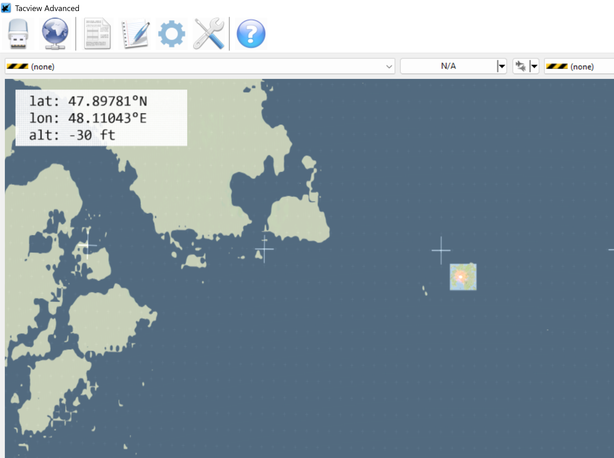

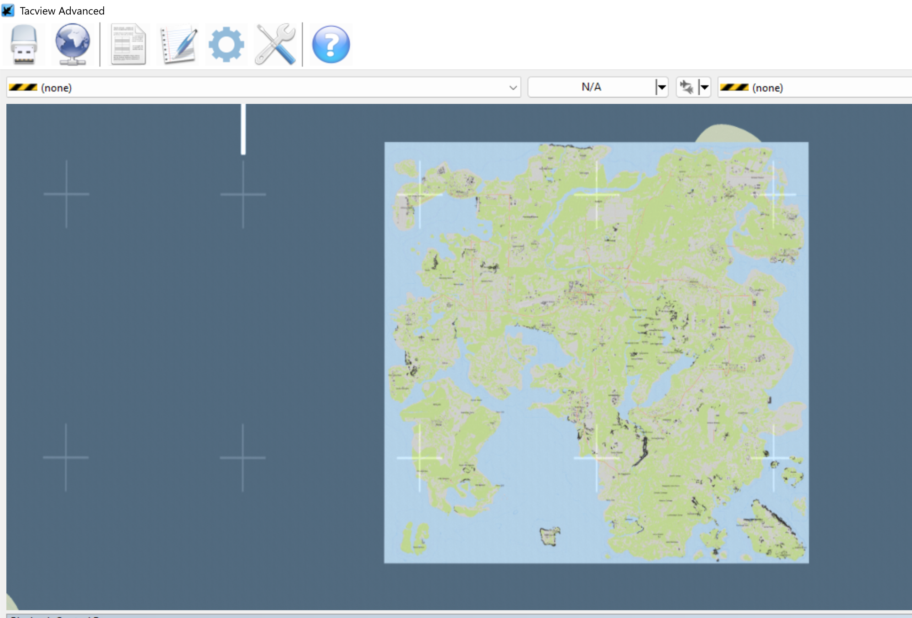

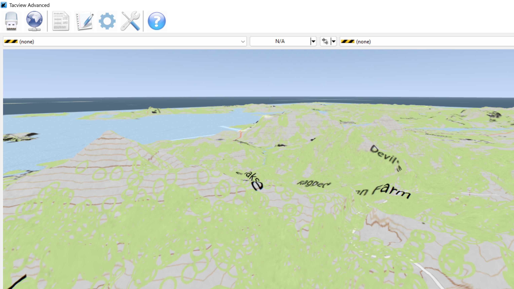

At this point you can revert Arma back to the non-development build in Steam.

# 3. Arma mod

Almost there! You're now going to hack the Arma mod to let it know about the new terrain. You can do this to the mod as downloaded from the Steam workshop, but any future updates will clobber your changes and you're have to redo them. It's safer to make a local copy of the mod. In the launcher you can go to the mod, expand the info panel, click the 3 dots for 'extra options' and choose 'Copy as a local mod'. I've saved it to my Documents folder for the purpose of this exercise. When you want to record a mission on your new terrain later on don't forget to disable the workshop mod and enable you local copy!

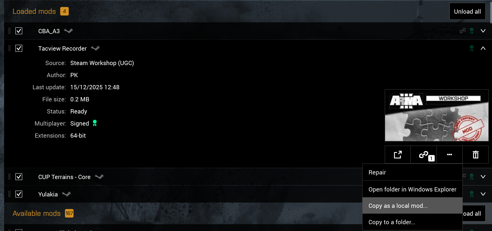

Open up the folder that holds the mod you're intending to hack (whether that be a local copy or from the workshop). Navigate into the `addons` folder. You're going to open up and modify the `tacview_recorder.pbo`. You can do this with any tools that let you work with Arma PBOs. I'm using PBO Manager as I mentioned in the prerequisite section. At this point you could unpack the PBO, edit the file and re-pack it, but PBO Manager also lets me replace a file without unpacking, so I'm going to do that.

Let's orient ourselves. Open up the PBO using whatever tool you're using. See the `functions/_worldConfig.sqf` file? That contains the list of terrains and maps them from Arma to Tacview. Have a look in this repo in the `out/mod` folder - see the `_worldConfig.sqf` file there? That was created when you ran `generate_configs.sh` earlier. That contains all the terrains that the mod already knows about with the addition of your new one.

Replace that file in the PBO with the one in the `out/mod` folder however suits you. I'll illustrate with PBO Manager. Open the PBO with Manager, expand the `functions` folder and drag'n'drop the file from `out/mod` into `functions`. You'll see a prompt with a dialog as whether you'd like to compress the file. Ignore that and click 'Next'. There's another dialog informing you that there's already a file of that name. You can right-click the little box at the right end of the row and change the option to 'replace'. Save the PBO. The process looks like the below.

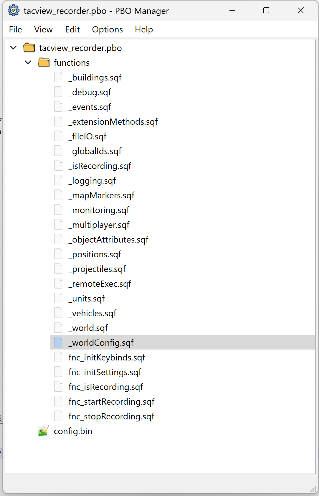

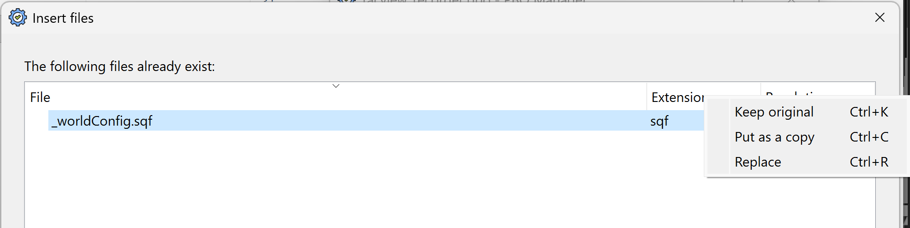

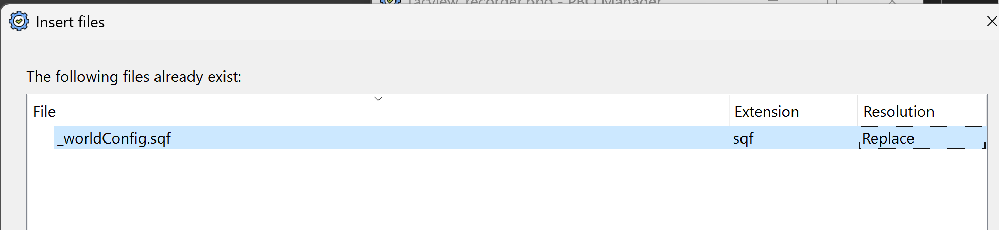

At this point you should be able to fire up Arma, jump into a mission on your new terrain and record it. Here's a screenshot of our hero Kerry in Yulakia.

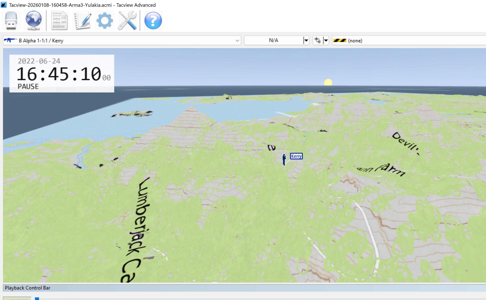

Congratulations! If you've made it to the end and got it working then you deserve a pat on the back. There are a lot of moving parts to make this work and a lot of subtle things that can go wrong.
