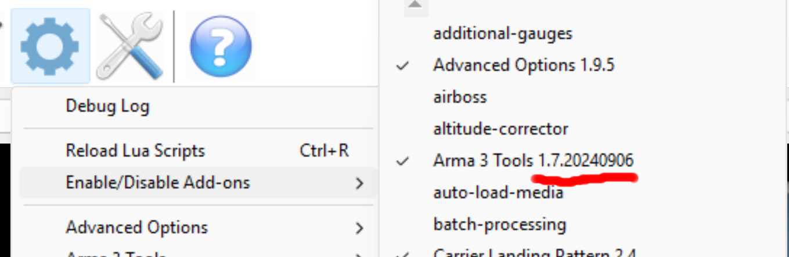

This page contains links to all the terrains supported by this mod.

You'll want to grab from here the terrains for any maps you wish to use in Arma, as well as the Tacview addon (this is distinct from the Arma mod on the Steam workshop). If you've already got the addon then check whether there's a newer version here than you have installed. You can determine this by looking in the settings menu of Tacview - the version appears in the name of the addon as shown below.

# Tacview addon

[1.7.20251215](https://github.com/petekneller/a3_tvr_terrains/releases/download/Addon-1.7.20251215/Addon-1.7.20251215.zip)

# Terrains

Please note that none of the content listed below is my work. The rights sit with the original authors.

| Name      | Content owner | Latest release |
| --- | --- | --- |
|  Altis  |  Bohemia Interactive  | [20220213](https://github.com/petekneller/a3_tvr_terrains/releases/download/Altis-20220213/Altis-20220213.zip) |
|  [Al Salman 2.0](https://steamcommunity.com/sharedfiles/filedetails/?id=2857846877)  |  [swurvin](https://steamcommunity.com/id/swurvin420/myworkshopfiles/?appid=107410)  | [20240703](https://github.com/petekneller/a3_tvr_terrains/releases/download/Al_Salmon_2-20240703/Al_Salmon_2-20240703.zip) |
|  [Anizay](https://steamcommunity.com/sharedfiles/filedetails/?id=1537973181)  |  [Temppa](https://steamcommunity.com/profiles/76561197960909051/myworkshopfiles/?appid=107410)  | [20220213](https://github.com/petekneller/a3_tvr_terrains/releases/download/Anizay-20220213/Anizay-20220213.zip) |
|  [Bukovina (CUP Terrains - Maps)](https://steamcommunity.com/sharedfiles/filedetails/?id=583544987)  |  [CUP Team](https://steamcommunity.com/id/cup-a3/myworkshopfiles/?appid=107410)  | [20220531](https://github.com/petekneller/a3_tvr_terrains/releases/download/Bukovina-20220531/Bukovina-20220531.zip) |
|  [Bystrica (CUP Terrains - Maps)](https://steamcommunity.com/sharedfiles/filedetails/?id=583544987)  |  [CUP Team](https://steamcommunity.com/id/cup-a3/myworkshopfiles/?appid=107410)  | [20220531](https://github.com/petekneller/a3_tvr_terrains/releases/download/Bystrica-20220531/Bystrica-20220531.zip) |
|  [Cam Lao Nam (SOG PF cDLC)](https://store.steampowered.com/app/1227700/Arma_3_Creator_DLC_SOG_Prairie_Fire/)  |  Savage Game Design  | [20220213](https://github.com/petekneller/a3_tvr_terrains/releases/download/Cam_Lao_Nam-20220213/Cam_Lao_Nam-20220213.zip) |
|  [Chernarus 2020 (CUP Terrains - Maps 2.0)](https://steamcommunity.com/sharedfiles/filedetails/?id=1981964169)  |  [CUP Team](https://steamcommunity.com/id/cup-a3/myworkshopfiles/?appid=107410)  | [20220531](https://github.com/petekneller/a3_tvr_terrains/releases/download/Chernarus_2020-20220531/Chernarus_2020-20220531.zip) |
|  [Chernarus Autumn (CUP Terrains - Maps)](https://steamcommunity.com/sharedfiles/filedetails/?id=583544987)  |  [CUP Team](https://steamcommunity.com/id/cup-a3/myworkshopfiles/?appid=107410)  | [20220531](https://github.com/petekneller/a3_tvr_terrains/releases/download/Chernarus_Autumn-20220531/Chernarus_Autumn-20220531.zip) |
|  [Chernarus Summer (CUP Terrains - Maps)](https://steamcommunity.com/sharedfiles/filedetails/?id=583544987)  |  [CUP Team](https://steamcommunity.com/id/cup-a3/myworkshopfiles/?appid=107410)  | [20220531](https://github.com/petekneller/a3_tvr_terrains/releases/download/Chernarus_Summer-20220531/Chernarus_Summer-20220531.zip) |
|  [Chernarus Winter (CUP Terrains - Maps)](https://steamcommunity.com/sharedfiles/filedetails/?id=583544987)  |  [CUP Team](https://steamcommunity.com/id/cup-a3/myworkshopfiles/?appid=107410)  | [20220531](https://github.com/petekneller/a3_tvr_terrains/releases/download/Chernarus_Winter-20220531/Chernarus_Winter-20220531.zip) |
|  [Dagger Island Training Complex (2025)](https://steamcommunity.com/sharedfiles/filedetails/?id=2983546566)  |  [Finger Jam](https://steamcommunity.com/id/realfingerjam/myworkshopfiles/?appid=107410)  | [20240906](https://github.com/petekneller/a3_tvr_terrains/releases/download/Dagger_Island_Training_Complex-20240906/Dagger_Island_Training_Complex-20240906.zip) |
|  [Dagger Island Training Complex (2025) (no targets)](https://steamcommunity.com/sharedfiles/filedetails/?id=2983546566)  |  [Finger Jam](https://steamcommunity.com/id/realfingerjam/myworkshopfiles/?appid=107410)  | [20240906](https://github.com/petekneller/a3_tvr_terrains/releases/download/Dagger_Island_Training_Complex_No_Targets-20240906/Dagger_Island_Training_Complex_No_Targets-20240906.zip) |
|  [Desert (CUP Terrains - Maps)](https://steamcommunity.com/sharedfiles/filedetails/?id=583544987)  |  [CUP Team](https://steamcommunity.com/id/cup-a3/myworkshopfiles/?appid=107410)  | [20220531](https://github.com/petekneller/a3_tvr_terrains/releases/download/Desert-20220531/Desert-20220531.zip) |
|  [Everon (CUP Terrains - CWA)](https://steamcommunity.com/sharedfiles/filedetails/?id=853743366)  |  [CUP Team](https://steamcommunity.com/id/cup-a3/myworkshopfiles/?appid=107410)  | [20220531](https://github.com/petekneller/a3_tvr_terrains/releases/download/Everon-20220531/Everon-20220531.zip) |
|  [Fapovo Island](https://steamcommunity.com/sharedfiles/filedetails/?id=1910457930)  |  [IceBreakr](https://steamcommunity.com/id/icebreakr/myworkshopfiles/?appid=107410)  | [20240703](https://github.com/petekneller/a3_tvr_terrains/releases/download/Fapovo_Island-20240703/Fapovo_Island-20240703.zip) |
|  [Fox Hutan](https://steamcommunity.com/sharedfiles/filedetails/?id=2306911815)  |  [Fox](https://steamcommunity.com/profiles/76561198150763475/myworkshopfiles/?appid=107410)  | [20220808](https://github.com/petekneller/a3_tvr_terrains/releases/download/Fox_Hutan-20220808/Fox_Hutan-20220808.zip) |
|  [Fox Pamai](https://steamcommunity.com/sharedfiles/filedetails/?id=2596566189)  |  [Fox](https://steamcommunity.com/profiles/76561198150763475/myworkshopfiles/?appid=107410)  | [20220808](https://github.com/petekneller/a3_tvr_terrains/releases/download/Fox_Pamai-20220808/Fox_Pamai-20220808.zip) |
|  [Fox Vanam](https://steamcommunity.com/sharedfiles/filedetails/?id=2639755526)  |  [Fox](https://steamcommunity.com/profiles/76561198150763475/myworkshopfiles/?appid=107410)  | [20220808](https://github.com/petekneller/a3_tvr_terrains/releases/download/Fox_Vanam-20220808/Fox_Vanam-20220808.zip) |
|  Hunting Grounds  |  Taro  | [20240628](https://github.com/petekneller/a3_tvr_terrains/releases/download/Hunting_Grounds-20240628/Hunting_Grounds-20240628.zip) |
|  [Hurtgen Forest](https://steamcommunity.com/sharedfiles/filedetails/?id=3214719358)  |  [E_50_Panzer](https://steamcommunity.com/profiles/76561198006572186/myworkshopfiles/?appid=107410)  | [20240703](https://github.com/petekneller/a3_tvr_terrains/releases/download/Hurtgen_Forest-20240703/Hurtgen_Forest-20240703.zip) |
|  [Kardazak](https://steamcommunity.com/sharedfiles/filedetails/?id=2994796909)  |  [swurvin](https://steamcommunity.com/id/swurvin420/myworkshopfiles/?appid=107410)  | [20240703](https://github.com/petekneller/a3_tvr_terrains/releases/download/Kardazak-20240703/Kardazak-20240703.zip) |
|  [Khe Sanh (SOG PF cDLC)](https://store.steampowered.com/app/1227700/Arma_3_Creator_DLC_SOG_Prairie_Fire/)  |  Savage Game Design  | [20220214](https://github.com/petekneller/a3_tvr_terrains/releases/download/Khe_Sanh-20220214/Khe_Sanh-20220214.zip) |
|  [Kolgujev (CUP Terrains - CWA)](https://steamcommunity.com/sharedfiles/filedetails/?id=853743366)  |  [CUP Team](https://steamcommunity.com/id/cup-a3/myworkshopfiles/?appid=107410)  | [20220531](https://github.com/petekneller/a3_tvr_terrains/releases/download/Kolgujev-20220531/Kolgujev-20220531.zip) |
|  [Kunduz River](https://steamcommunity.com/sharedfiles/filedetails/?id=3078351739)  |  [[SRRP]T/Sgt.Enfisk](https://steamcommunity.com/id/enfisk_/myworkshopfiles/?appid=107410)  | [20240906](https://github.com/petekneller/a3_tvr_terrains/releases/download/Kunduz_River-20240906/Kunduz_River-20240906.zip) |
|  Livonia  |  Bohemia Interactive  | [20220214](https://github.com/petekneller/a3_tvr_terrains/releases/download/Livonia-20220214/Livonia-20220214.zip) |
|  [LYTHIUM](https://steamcommunity.com/sharedfiles/filedetails/?id=909547724)  |  [Green_Beret](https://steamcommunity.com/profiles/76561198015435179/myworkshopfiles/?appid=107410)  | [20240703](https://github.com/petekneller/a3_tvr_terrains/releases/download/Lythium-20240703/Lythium-20240703.zip) |
|  [Malden (CUP Terrains - CWA)](https://steamcommunity.com/sharedfiles/filedetails/?id=853743366)  |  [CUP Team](https://steamcommunity.com/id/cup-a3/myworkshopfiles/?appid=107410)  | [20220531](https://github.com/petekneller/a3_tvr_terrains/releases/download/Malden-20220531/Malden-20220531.zip) |
|  Malden 2035  |  Bohemia Interactive  | [20220214](https://github.com/petekneller/a3_tvr_terrains/releases/download/Malden2035-20220214/Malden2035-20220214.zip) |
|  [Mogadishu](https://steamcommunity.com/sharedfiles/filedetails/?id=749790006)  |  [Variable.A](https://steamcommunity.com/profiles/76561197983110973/myworkshopfiles/?appid=107410)  | [20220213](https://github.com/petekneller/a3_tvr_terrains/releases/download/Mogadishu-20220213/Mogadishu-20220213.zip) |
|  [Nogova (CUP Terrains - CWA)](https://steamcommunity.com/sharedfiles/filedetails/?id=853743366)  |  [CUP Team](https://steamcommunity.com/id/cup-a3/myworkshopfiles/?appid=107410)  | [20220531](https://github.com/petekneller/a3_tvr_terrains/releases/download/Nogova-20220531/Nogova-20220531.zip) |
|  [Normandy (Spearhead 1944 cDLC)](https://store.steampowered.com/app/1175380/Arma_3_Creator_DLC_Spearhead_1944/)  |  Heavy Ordnance Works  | [20240703](https://github.com/petekneller/a3_tvr_terrains/releases/download/Normandy-20240703/Normandy-20240703.zip) |
|  [Novogorsk](https://steamcommunity.com/sharedfiles/filedetails/?id=2979021411)  |  [swurvin](https://steamcommunity.com/id/swurvin420/myworkshopfiles/?appid=107410)  | [20240703](https://github.com/petekneller/a3_tvr_terrains/releases/download/Novogorsk-20240703/Novogorsk-20240703.zip) |
|  [Porto (CUP Terrains - Maps)](https://steamcommunity.com/sharedfiles/filedetails/?id=583544987)  |  [CUP Team](https://steamcommunity.com/id/cup-a3/myworkshopfiles/?appid=107410)  | [20220531](https://github.com/petekneller/a3_tvr_terrains/releases/download/Porto-20220531/Porto-20220531.zip) |
|  [Proving Grounds (CUP Terrains - Maps)](https://steamcommunity.com/sharedfiles/filedetails/?id=583544987)  |  [CUP Team](https://steamcommunity.com/id/cup-a3/myworkshopfiles/?appid=107410)  | [20220531](https://github.com/petekneller/a3_tvr_terrains/releases/download/Proving_Grounds-20220531/Proving_Grounds-20220531.zip) |
|  [Rahmadi (CUP Terrains - Maps)](https://steamcommunity.com/sharedfiles/filedetails/?id=583544987)  |  [CUP Team](https://steamcommunity.com/id/cup-a3/myworkshopfiles/?appid=107410)  | [20220531](https://github.com/petekneller/a3_tvr_terrains/releases/download/Rahmadi-20220531/Rahmadi-20220531.zip) |
|  [Sa'hatra](https://steamcommunity.com/sharedfiles/filedetails/?id=3019928771)  |  [juj](https://steamcommunity.com/profiles/76561198119533591/myworkshopfiles/?appid=107410)  | [20240703](https://github.com/petekneller/a3_tvr_terrains/releases/download/Sahatra-20240703/Sahatra-20240703.zip) |
|  [Sahrani (CUP Terrains - Maps)](https://steamcommunity.com/sharedfiles/filedetails/?id=583544987)  |  [CUP Team](https://steamcommunity.com/id/cup-a3/myworkshopfiles/?appid=107410)  | [20220531](https://github.com/petekneller/a3_tvr_terrains/releases/download/Sahrani-20220531/Sahrani-20220531.zip) |
|  [Shapur (CUP Terrains - Maps)](https://steamcommunity.com/sharedfiles/filedetails/?id=583544987)  |  [CUP Team](https://steamcommunity.com/id/cup-a3/myworkshopfiles/?appid=107410)  | [20220531](https://github.com/petekneller/a3_tvr_terrains/releases/download/Shapur-20220531/Shapur-20220531.zip) |
|  [Southern Sahrani (CUP Terrains - Maps)](https://steamcommunity.com/sharedfiles/filedetails/?id=583544987)  |  [CUP Team](https://steamcommunity.com/id/cup-a3/myworkshopfiles/?appid=107410)  | [20220531](https://github.com/petekneller/a3_tvr_terrains/releases/download/Southern_Sahrani-20220531/Southern_Sahrani-20220531.zip) |
|  Altis  |  Bohemia Interactive  | [20220214](https://github.com/petekneller/a3_tvr_terrains/releases/download/Stratis-20220214/Stratis-20220214.zip) |
|  [Takistan (CUP Terrains - Maps)](https://steamcommunity.com/sharedfiles/filedetails/?id=583544987)  |  [CUP Team](https://steamcommunity.com/id/cup-a3/myworkshopfiles/?appid=107410)  | [20220531](https://github.com/petekneller/a3_tvr_terrains/releases/download/Takistan-20220531/Takistan-20220531.zip) |
|  [Takistan Mountains (CUP Terrains - Maps)](https://steamcommunity.com/sharedfiles/filedetails/?id=583544987)  |  [CUP Team](https://steamcommunity.com/id/cup-a3/myworkshopfiles/?appid=107410)  | [20220531](https://github.com/petekneller/a3_tvr_terrains/releases/download/Takistan_Mountains-20220531/Takistan_Mountains-20220531.zip) |
|  Tanoa  |  Bohemia Interactive  | [20220214](https://github.com/petekneller/a3_tvr_terrains/releases/download/Tanoa-20220214/Tanoa-20220214.zip) |
|  [The Bra (SOG PF cDLC)](https://store.steampowered.com/app/1227700/Arma_3_Creator_DLC_SOG_Prairie_Fire/)  |  Savage Game Design  | [20220713](https://github.com/petekneller/a3_tvr_terrains/releases/download/The_Bra-20220713/The_Bra-20220713.zip) |
|  [United Sahrani (CUP Terrains - Maps)](https://steamcommunity.com/sharedfiles/filedetails/?id=583544987)  |  [CUP Team](https://steamcommunity.com/id/cup-a3/myworkshopfiles/?appid=107410)  | [20220531](https://github.com/petekneller/a3_tvr_terrains/releases/download/United_Sahrani-20220531/United_Sahrani-20220531.zip) |
|  [Ba Long (Unsung Redux Stable)](https://steamcommunity.com/sharedfiles/filedetails/?id=2554978758)  |  [Unsung team](https://steamcommunity.com/profiles/76561199007644603/myworkshopfiles/?appid=107410)  | [20230129](https://github.com/petekneller/a3_tvr_terrains/releases/download/Unsung_Redux_BaLong-20230129/Unsung_Redux_BaLong-20230129.zip) |
|  [Da Krong (Unsung Redux Stable)](https://steamcommunity.com/sharedfiles/filedetails/?id=2554978758)  |  [Unsung team](https://steamcommunity.com/profiles/76561199007644603/myworkshopfiles/?appid=107410)  | [20230129](https://github.com/petekneller/a3_tvr_terrains/releases/download/Unsung_Redux_DaKrong-20230129/Unsung_Redux_DaKrong-20230129.zip) |
|  [Dak Pek (Unsung Redux Stable)](https://steamcommunity.com/sharedfiles/filedetails/?id=2554978758)  |  [Unsung team](https://steamcommunity.com/profiles/76561199007644603/myworkshopfiles/?appid=107410)  | [20230129](https://github.com/petekneller/a3_tvr_terrains/releases/download/Unsung_Redux_DakPek-20230129/Unsung_Redux_DakPek-20230129.zip) |
|  [Lowlands (Unsung Redux Stable)](https://steamcommunity.com/sharedfiles/filedetails/?id=2554978758)  |  [Unsung team](https://steamcommunity.com/profiles/76561199007644603/myworkshopfiles/?appid=107410)  | [20230129](https://github.com/petekneller/a3_tvr_terrains/releases/download/Unsung_Redux_Lowlands-20230129/Unsung_Redux_Lowlands-20230129.zip) |
|  [Doung Island (Unsung Redux Stable)](https://steamcommunity.com/sharedfiles/filedetails/?id=2554978758)  |  [Unsung team](https://steamcommunity.com/profiles/76561199007644603/myworkshopfiles/?appid=107410)  | [20230129](https://github.com/petekneller/a3_tvr_terrains/releases/download/Unsung_Redux_DoungIsland-20230129/Unsung_Redux_DoungIsland-20230129.zip) |
|  [Song Bin Tanh (Unsung Redux Stable)](https://steamcommunity.com/sharedfiles/filedetails/?id=2554978758)  |  [Unsung team](https://steamcommunity.com/profiles/76561199007644603/myworkshopfiles/?appid=107410)  | [20230129](https://github.com/petekneller/a3_tvr_terrains/releases/download/Unsung_Redux_SongBinTanh-20230129/Unsung_Redux_SongBinTanh-20230129.zip) |
|  [Utah Beach (Spearhead Extended)](https://steamcommunity.com/sharedfiles/filedetails/?id=3117898674)  |  [Heavy Ordnance Works](https://steamcommunity.com/profiles/76561199518649705/myworkshopfiles/?appid=107410)  | [20240703](https://github.com/petekneller/a3_tvr_terrains/releases/download/Utah_Beach-20240703/Utah_Beach-20240703.zip) |
|  [Utes (CUP Terrains - Maps)](https://steamcommunity.com/sharedfiles/filedetails/?id=583544987)  |  [CUP Team](https://steamcommunity.com/id/cup-a3/myworkshopfiles/?appid=107410)  | [20220531](https://github.com/petekneller/a3_tvr_terrains/releases/download/Utes-20220531/Utes-20220531.zip) |
|  Virtual Reality  |  Bohemia Interactive  | [20220531](https://github.com/petekneller/a3_tvr_terrains/releases/download/Virtual_Reality-20220531/Virtual_Reality-20220531.zip) |
|  [Weferlingen Summer (Global Mobilization - Cold War Germany cDLC)](https://store.steampowered.com/app/1042220/Arma_3_Creator_DLC_Global_Mobilization__Cold_War_Germany/)  |  Vertexmacht  | [20240703](https://github.com/petekneller/a3_tvr_terrains/releases/download/Weferlingen_Summer-20240703/Weferlingen_Summer-20240703.zip) |
|  [Weferlingen Winter (Global Mobilization - Cold War Germany cDLC)](https://store.steampowered.com/app/1042220/Arma_3_Creator_DLC_Global_Mobilization__Cold_War_Germany/)  |  Vertexmacht  | [20240703](https://github.com/petekneller/a3_tvr_terrains/releases/download/Weferlingen_Winter-20240703/Weferlingen_Winter-20240703.zip) |
|  [Zargabad (CUP Terrains - Maps)](https://steamcommunity.com/sharedfiles/filedetails/?id=583544987)  |  [CUP Team](https://steamcommunity.com/id/cup-a3/myworkshopfiles/?appid=107410)  | [20220531](https://github.com/petekneller/a3_tvr_terrains/releases/download/Zargabad-20220531/Zargabad-20220531.zip) |
